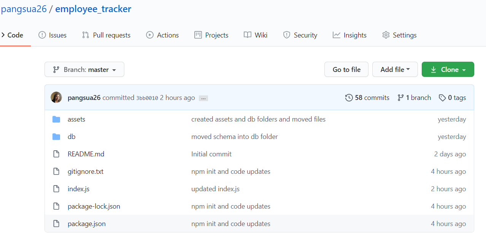

# employee_tracker

## Project Description
For this activity, we are tasked with creating interfaces that make it easy for non-developers to view and interact with employee information stored in the databases; known as **C**ontent **M**anagement **S**ystems. 

## Minimum Requirements

* Functional application.

* GitHub repository with a unique name and a README describing the project.

* The command-line application should allow users to:

  * Add departments, roles, employees

  * View departments, roles, employees

  * Update employee roles

  ## Experience
  Let's just say this homework was HARD!

  ## Other Notes
  Due to password security issues, Charlie suggested I create a new Repo (named employee-tracker2) and delete my original repo. Thus, commits on this new repo are small. However, I captured an image of the old repo for "commit history" purposes.
  

